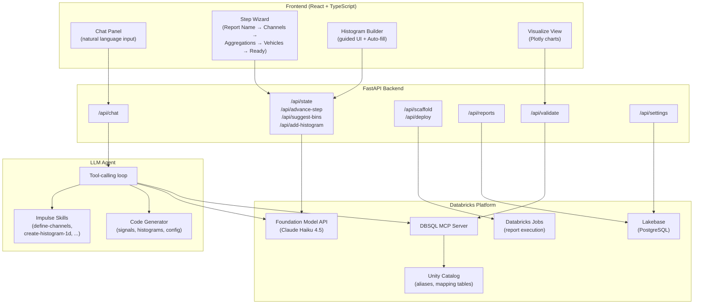

# Impulse — Databricks App

A full-stack web application for creating Impulse framework data reports through a guided, natural-language interface. Users describe their report requirements in plain English and the app scaffolds, deploys, and runs the report as a Databricks job. Report definitions are persisted in Lakebase so they can be loaded and re-deployed later.

**Stack:** FastAPI (Python) + React (TypeScript), hosted as a Databricks App.

## Architecture



### Key directories

| Path | Description |
|------|-------------|
| `app.py` | FastAPI entry point |
| `app.yaml` | Databricks App configuration |
| `requirements.txt` | Python dependencies |
| `server/config.py` | Auth + environment detection |
| `server/agent.py` | LLM agent with tool-calling |
| `server/db.py` | Lakebase (PostgreSQL) connection layer |
| `server/token_store.py` | Encrypted PAT + cluster config storage |
| `server/report_store.py` | Save / load / delete report definitions |
| `server/skill_loader.py` | Dynamic system prompt composition |
| `server/code_generator.py` | Report code generation (signals, histograms, config) |
| `server/mcp_tools.py` | MCP server integration for SQL |
| `server/models.py` | Pydantic data models |
| `server/routes/` | API endpoint routers |
| `frontend/src/` | React TypeScript source |
| `frontend/dist/` | Production build (served as static files) |
| `skills/` | LLM skill documentation |
| `.template/` | DAB template for report scaffolding |

## Prerequisites

1. **Databricks CLI v0.285.0+** (with `postgres` command group for Lakebase setup)
   ```bash
   databricks --version
   ```

2. **Node.js 18+** and npm (for frontend builds)
   ```bash
   node --version
   ```

3. **Python 3.11+** with `databricks-sdk>=0.81.0` (required for `w.postgres` module)

4. A **Databricks profile** configured in `~/.databrickscfg`
   (the app uses profile `<your-profile>` by default)

5. Access to:
   - A Databricks SQL Warehouse (default: `724ba849cc0940aa`)
   - A Foundation Model API serving endpoint (default: `databricks-claude-haiku-4-5`)
   - Unity Catalog tables for channel aliases and vehicle mapping

## Deploy to Databricks

### Step 1: Build the frontend

```bash
cd apps/impulse/frontend
npm install
npm run build
```

### Step 2: Create the app (first time only)

```bash
databricks apps create impulse --profile <your-profile>
```

Wait for the command to complete. This provisions compute and a service principal for the app.

### Step 3: Create Lakebase infrastructure (first time only)

```bash
# Create the Lakebase Autoscaling project (managed PostgreSQL)
databricks postgres create-project impulse \
  --json '{"spec": {"display_name": "Impulse"}}' \
  --no-wait -p <your-profile>

# Wait for endpoint to become ACTIVE (~1-2 min)
databricks postgres list-endpoints \
  projects/impulse/branches/production \
  -p <your-profile> -o json
```

Once the endpoint is active, create the application database and set up the
service principal's OAuth role. Connect via `psycopg` (or `psql`) as the
project owner:

```python
import subprocess, json, psycopg

# Generate a short-lived OAuth token for the human user
result = subprocess.run(
    ["databricks", "postgres", "generate-database-credential",
     "projects/impulse/branches/production/endpoints/primary",
     "-o", "json", "--profile", "<your-profile>"],
    capture_output=True, text=True,
)
cred = json.loads(result.stdout)

# Connect to the default database first to create the app database
conn = psycopg.connect(
    host="<endpoint-host>",  # from list-endpoints output
    port=5432,
    dbname="databricks_postgres",
    user="<your-email>",
    password=cred["token"],
    sslmode="require",
    autocommit=True,
)
conn.cursor().execute("CREATE DATABASE impulse;")
conn.close()

# Reconnect to the new database
conn = psycopg.connect(
    host="<endpoint-host>",
    port=5432,
    dbname="impulse",
    user="<your-email>",
    password=cred["token"],
    sslmode="require",
    autocommit=True,
)
cur = conn.cursor()

# Create the databricks_auth extension (required for OAuth roles)
cur.execute("CREATE EXTENSION IF NOT EXISTS databricks_auth;")

# Create an OAuth-enabled Postgres role for the app's service principal.
# IMPORTANT: You must use databricks_create_role() — a plain CREATE ROLE
# does NOT support OAuth token authentication.
cur.execute(
    "SELECT databricks_create_role('<sp-client-id>', 'SERVICE_PRINCIPAL');"
)

# Grant privileges
cur.execute('GRANT ALL PRIVILEGES ON DATABASE impulse TO "<sp-client-id>";')
cur.execute('GRANT ALL ON SCHEMA public TO "<sp-client-id>";')
conn.close()
```

> **Why `databricks_create_role`?** Lakebase Autoscaling authenticates
> connections using OAuth tokens validated by the `databricks_auth`
> extension. Roles created with standard `CREATE ROLE` only support
> password authentication and will reject OAuth tokens with
> `password authentication failed`.
> See [Lakebase Postgres roles documentation](https://learn.microsoft.com/en-us/azure/databricks/oltp/projects/postgres-roles).

The app automatically creates the required tables on first startup via
`server/db.py` `init_schema()`. The schema consists of:

```sql
-- Per-user settings: encrypted PAT and all-purpose cluster ID
CREATE TABLE IF NOT EXISTS user_settings (
    user_email    TEXT PRIMARY KEY,
    encrypted_pat TEXT NOT NULL DEFAULT '',
    cluster_id    TEXT NOT NULL DEFAULT '',
    updated_at    TIMESTAMP DEFAULT NOW()
);

-- Persisted report definitions (wizard-configured fields only)
CREATE TABLE IF NOT EXISTS saved_reports (
    id            UUID PRIMARY KEY DEFAULT gen_random_uuid(),
    user_email    TEXT NOT NULL,
    report_name   TEXT NOT NULL,
    report_state  JSONB NOT NULL,
    created_at    TIMESTAMP DEFAULT NOW(),
    updated_at    TIMESTAMP DEFAULT NOW(),
    UNIQUE (user_email, report_name)
);
CREATE INDEX IF NOT EXISTS idx_saved_reports_user ON saved_reports(user_email);
```

> **Note:** If you modify the schema (e.g., adding columns), `CREATE TABLE IF NOT EXISTS`
> will not alter existing tables. You must run `ALTER TABLE` manually against Lakebase
> or drop and recreate the table. See the Troubleshooting section for details.

Next, create a Databricks secret scope for the Fernet encryption key
(used to encrypt stored PATs at rest):

```bash
databricks secrets create-scope impulse --profile <your-profile>

# Generate a Fernet key and store it
python3 -c "from cryptography.fernet import Fernet; print(Fernet.generate_key().decode())"
databricks secrets put-secret impulse fernet-key \
  --string-value "<generated-key>" --profile <your-profile>

# Grant the app's service principal READ access to the scope
databricks secrets put-acl impulse <sp-client-id> READ \
  --profile <your-profile>
```

### Step 4: Update `app.yaml`

Verify that `app.yaml` contains the correct values for:

| Variable | Description |
|----------|-------------|
| `DATABRICKS_WAREHOUSE_ID` | Your SQL warehouse ID |
| `SERVING_ENDPOINT` | Your Foundation Model API endpoint name |
| `LAKEBASE_HOST` | From: `databricks postgres list-endpoints ...` |
| `LAKEBASE_PORT` | `5432` |
| `LAKEBASE_DB` | `impulse` |
| `SECRET_SCOPE` | `impulse` |
| `SECRET_KEY_NAME` | `fernet-key` |

### Step 5: Stage clean sources (exclude `.venv` and dev files)

```bash
rm -rf /tmp/impulse-deploy
rsync -av \
  --exclude='.venv' \
  --exclude='__pycache__' \
  --exclude='node_modules' \
  --exclude='frontend/src' \
  --exclude='frontend/tsconfig*.json' \
  --exclude='frontend/vite.config.ts' \
  --exclude='frontend/package-lock.json' \
  --exclude='.git' \
  --exclude='reports' \
  --exclude='.DS_Store' \
  apps/impulse/ /tmp/impulse-deploy/
```

### Step 6: Upload to workspace

```bash
# Delete old files if redeploying
databricks workspace delete --recursive \
  /Users/<your-email>/apps/impulse --profile <your-profile>

databricks workspace import-dir \
  /tmp/impulse-deploy \
  /Users/<your-email>/apps/impulse \
  --profile <your-profile> --overwrite
```

### Step 7: Deploy

```bash
databricks apps deploy impulse \
  --source-code-path /Workspace/Users/<your-email>/apps/impulse \
  --profile <your-profile> --no-wait

# Check deployment status
databricks apps get impulse --profile <your-profile>
```

The app URL will be shown in the output, e.g.:
`https://impulse-<workspace-id>.1.azure.databricksapps.com`

### Step 8: Grant the service principal access

The app's service principal (shown as `service_principal_client_id` in the `databricks apps create` output) needs the following permissions:

| Permission | How to grant |
|------------|-------------|
| Read Unity Catalog tables (channel aliases, vehicle mapping) | `GRANT SELECT ON TABLE ... TO <sp-name>` |
| Access the SQL Warehouse | Add SP to warehouse permissions in workspace admin |
| Access the Foundation Model API endpoint | Add SP to endpoint permissions |
| **READ on secret scope** | `databricks secrets put-acl impulse <sp-client-id> READ --profile <your-profile>` |
| **Lakebase OAuth role + privileges** | See Step 3 — `databricks_create_role('<sp-client-id>', 'SERVICE_PRINCIPAL')` and `GRANT` statements |

> **Common errors:**
>
> - `PermissionDenied: User <sp-id> does not have READ permission on scope impulse` — the secret scope ACL was not set. Run the `secrets put-acl` command from Step 3.
> - `ValueError: Fernet key must be 32 url-safe base64-encoded bytes` — the Databricks SDK returns secret values base64-encoded. The app already handles this; verify the key was stored as the raw Fernet key string (not double-encoded).
> - `password authentication failed for user '<sp-client-id>'` — the Lakebase Postgres role was created with plain `CREATE ROLE` instead of `databricks_create_role()`. Drop the role and recreate it using the `databricks_auth` extension as shown in Step 3.

## Redeployment (after code changes)

```bash
cd apps/impulse/frontend && npm run build && cd -

rm -rf /tmp/impulse-deploy
rsync -av \
  --exclude='.venv' --exclude='__pycache__' --exclude='node_modules' \
  --exclude='frontend/src' --exclude='frontend/tsconfig*.json' \
  --exclude='frontend/vite.config.ts' --exclude='frontend/package-lock.json' \
  --exclude='.git' --exclude='reports' --exclude='.DS_Store' \
  apps/impulse/ /tmp/impulse-deploy/

databricks workspace delete --recursive \
  /Users/<your-email>/apps/impulse --profile <your-profile>
databricks workspace import-dir /tmp/impulse-deploy \
  /Users/<your-email>/apps/impulse --profile <your-profile> --overwrite
databricks apps deploy impulse \
  --source-code-path /Workspace/Users/<your-email>/apps/impulse \
  --profile <your-profile> --no-wait
```

## Run Locally

Local mode uses your Databricks profile (`~/.databrickscfg`) for authentication. Lakebase is not used — no database, no PAT storage. Deploy/run operations use the CLI with your local profile credentials.

### Step 1: Install Python dependencies

```bash
cd apps/impulse
python3 -m venv .venv
source .venv/bin/activate
pip install -r requirements.txt
```

### Step 2: Build the frontend

```bash
cd frontend
npm install
npm run build
cd ..
```

### Step 3: Configure local MCP server (optional)

If you want to use a local MCP server instead of the Databricks managed one, create `.cursor/mcp.json` in the repo root with your server configuration.

### Step 4: Start the app

```bash
# Uses profile "<your-profile>" by default. Override with:
# export DATABRICKS_PROFILE=your-profile

python3 -m uvicorn app:app --reload --port 8001
```

Open [http://localhost:8001](http://localhost:8001) in your browser.

### Step 5: Frontend development (hot reload)

In a separate terminal:

```bash
cd apps/impulse/frontend
npm run dev
```

This starts the Vite dev server on `http://localhost:5173` with hot reload. API calls are proxied to the backend on port 8001 (configure in `vite.config.ts` if needed).

## Impulse Framework

The app depends on the Impulse framework (`mda_query_engine` / `mda_reporting`) which is developed in a separate repository. A pre-built wheel is bundled at `.template/template/lib/` and automatically included in every scaffolded report project. Databricks installs it on the cluster when the report job runs — notebooks simply `import mda_reporting`.

**Updating the framework version:**

1. In the framework repository, build a new wheel: `uv build --wheel`
2. Delete the old `.whl` from `.template/template/lib/`
3. Copy the new `.whl` into `.template/template/lib/`
4. Update the wheel filename in `.template/template/resources/jobs.yml.tmpl` (the `dependencies:` line under the `impulse` environment)
5. Commit and redeploy the app

## Environment Variables

| Variable | Default | Description |
|----------|---------|-------------|
| `DATABRICKS_WAREHOUSE_ID` | `724ba849cc0940aa` | SQL Warehouse ID |
| `SERVING_ENDPOINT` | `databricks-claude-haiku-4-5` | LLM endpoint name |
| `DATABRICKS_PROFILE` | `<your-profile>` | CLI profile (local only) |
| `LAKEBASE_HOST` | *(none)* | Lakebase endpoint host |
| `LAKEBASE_PORT` | `5432` | Lakebase port |
| `LAKEBASE_DB` | `impulse` | Lakebase database name |
| `SECRET_SCOPE` | `impulse` | Databricks secret scope |
| `SECRET_KEY_NAME` | `fernet-key` | Secret key for Fernet |

## Authentication & Permissions

Impulse uses three authentication layers. The goal is fully passwordless operation — no PATs, no stored passwords — using Databricks' built-in OAuth and identity forwarding.

### Identity Model

| Identity | How it works | Used for |
|----------|-------------|----------|
| **App Service Principal** | Auto-provisioned when the app is created. Authenticates via OAuth M2M (client credentials injected as `DATABRICKS_CLIENT_ID`/`DATABRICKS_CLIENT_SECRET` env vars). | Lakebase read/write, LLM calls (FMAPI), MCP tool discovery |
| **Logged-in User (OBO token)** | The Databricks proxy injects `X-Forwarded-Access-Token` (OAuth On-Behalf-Of token) and `X-Forwarded-Email` headers on every request. The token carries `all-apis` scope from the app's custom OAuth integration. | SQL queries, UC browsing, Deploy & Run (bundle deploy/run), job creation |

### How Each Component Authenticates

```
┌─────────────────────────────────────────────────────────────────┐
│  Databricks Apps Proxy                                          │
│  ┌─────────────────────────────────────────────────────────┐    │
│  │  Injects on every request:                              │    │
│  │  • X-Forwarded-Email: user@company.com                  │    │
│  │  • X-Forwarded-Access-Token: <OAuth token>  (if scopes) │    │
│  └─────────────────────────────────────────────────────────┘    │
└─────────────────────────────────────────────────────────────────┘
                              │
                              ▼
┌─────────────────────────────────────────────────────────────────┐
│  FastAPI Backend                                                │
│                                                                 │
│  SQL queries ──────────► User's OBO token (from header)         │
│  UC browsing ──────────► User's OBO token (from header)         │
│  Deploy & Run ────────► User's OBO token (all-apis scope)       │
│  LLM agent calls ─────► App SP (built-in M2M OAuth)            │
│  Lakebase (reports) ──► App SP (generate_database_credential)   │
└─────────────────────────────────────────────────────────────────┘
```

### User Authorization (OBO Token)

User Authorization enables the `X-Forwarded-Access-Token` header. Without it, the header is absent and all operations fall back to the app service principal.

**How it works:** Each Databricks App automatically gets a custom OAuth app integration with default scopes including `all-apis`. The `X-Forwarded-Access-Token` is an On-Behalf-Of (OBO) OAuth token that carries these scopes, giving the app full API access as the logged-in user.

**Setup:**
1. A workspace admin must enable **"User token passthrough"** in Admin Settings (one-time)
2. The deploy script automatically sets workspace-level scopes (`sql`, `files.files`) via `databricks apps update`
3. Optionally, an account admin can pre-authorize user consent to skip the consent prompt:
   ```bash
   databricks account custom-app-integration update '<integration-id>' \
     --json '{"user_authorized_scopes": [""]}'
   ```

**What the token covers:**
- SQL queries on warehouses (respects UC row/column security)
- Unity Catalog browsing (catalogs, schemas, tables)
- `databricks bundle deploy` and `databricks bundle run` (Jobs API, Workspace API)
- All other Databricks REST APIs (via `all-apis` scope)

### Lakebase Access (Passwordless)

The app connects to Lakebase PostgreSQL using **OAuth tokens, not passwords**:

1. App SP calls `w.postgres.generate_database_credential(endpoint=...)` via the Databricks SDK
2. This returns a short-lived JWT (1 hour), used as the Postgres password
3. The JWT's `sub` claim (SP client ID) is the Postgres username
4. The `databricks_auth` extension validates the JWT server-side

**Requirements:**
- The `databricks_auth` extension must be installed in the database
- A Postgres role must be created via `databricks_create_role('<sp-client-id>', 'SERVICE_PRINCIPAL')` — plain `CREATE ROLE` does NOT support OAuth
- The SP must have `GRANT ALL ON SCHEMA public` for table creation

Token expiration (1 hour) is enforced only at connection time. Open connections remain active past expiry, with a 24-hour idle timeout and 3-day max lifetime.

### Deploy & Run (Passwordless)

Deploy & Run uses the user's OBO token (`X-Forwarded-Access-Token`) passed to the Databricks CLI as `DATABRICKS_TOKEN`. The CLI executes `databricks bundle deploy` and `databricks bundle run` as the logged-in user, creating and running jobs with the user's own permissions. No PATs or stored credentials are needed.

### Service Principal Permissions

The app's SP (shown as `service_principal_client_id` in `databricks apps get`) needs:

| Resource | Permission | How to grant |
|----------|-----------|--------------|
| SQL Warehouse | CAN USE | Warehouse permissions in workspace admin UI |
| Foundation Model API endpoint | CAN QUERY | Endpoint permissions in workspace admin UI |
| Lakebase database | OAuth role + ALL PRIVILEGES | `databricks_create_role()` + `GRANT` (see Step 3) |
| UC tables (channel aliases, vehicle mapping) | SELECT | `GRANT SELECT ON TABLE ... TO <sp-name>` |

### Local Development Auth

When running locally (`IS_DATABRICKS_APP=False`):
- All operations use the Databricks CLI profile from `~/.databrickscfg`
- No Lakebase, no PAT storage, no settings UI
- Sessions are in-memory only
- Set via `DATABRICKS_PROFILE` env var (defaults to profile in CLAUDE.md)

## Troubleshooting

**"Backend modules failed to load"**
Check the app logs. Common causes: missing Python dependency, Lakebase connection failure, or incorrect environment variables.

**"Source code path must be a valid workspace path"**
The `--source-code-path` for `databricks apps deploy` must be a Databricks workspace path (starting with `/Workspace/`), not a local filesystem path.

**Deployment is slow / `.venv` uploaded**
Always use `rsync` with `--exclude='.venv'` when staging sources. See the deployment steps above.

**"Job Failed" but job is still running on Databricks**
The app polls the Databricks Jobs API every 30 seconds. If the CLI process exits early, the actual job status is still tracked via the API. Wait for the next poll cycle.

**`password authentication failed for user '<sp-client-id>'`**
The Postgres role for the service principal must be created using `databricks_create_role()` from the `databricks_auth` extension — not with plain `CREATE ROLE`. Plain roles only support password authentication and will reject OAuth tokens. See Step 3 for the correct procedure.

**`unknown command "postgres" for "databricks"` (inside the app container)**
The Databricks CLI bundled in the app container may not include the `postgres` command group. The app uses the Python SDK (`w.postgres.generate_database_credential()`) instead of the CLI for Lakebase credential generation. Ensure `databricks-sdk>=0.81.0` is in `requirements.txt`.

**`there is no unique or exclusion constraint matching the ON CONFLICT specification`**
The `saved_reports` table was created without the `UNIQUE (user_email, report_name)` constraint. This happens when `init_schema()` created the table before the constraint was added to `_SCHEMA_SQL` — `CREATE TABLE IF NOT EXISTS` does not alter existing tables. Fix by running directly against Lakebase:

```sql
ALTER TABLE saved_reports
ADD CONSTRAINT saved_reports_user_email_report_name_key
UNIQUE (user_email, report_name);
```

**`column "cluster_id" of relation "user_settings" does not exist`**
Similar to the above — the `user_settings` table was created before `cluster_id` was added to the schema. Fix by either adding the column manually (`ALTER TABLE user_settings ADD COLUMN cluster_id TEXT NOT NULL DEFAULT '';`) or dropping and recreating the table (this will clear stored PATs).
