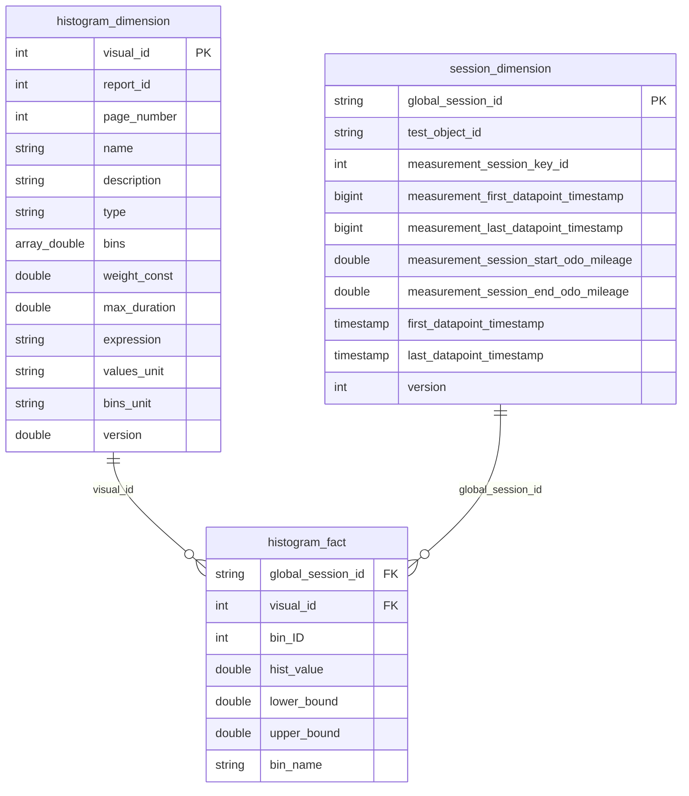

# Visualize 1D Histogram

Read and visualize 1D histogram results from the gold layer tables of a calculated Impulse framework report.

## Gold Layer Data Model

Histogram results are stored in a star schema with two tables and an optional session dimension for filtering.

### ER Diagram



### Table Naming Convention

Tables follow the pattern: `{catalog}.{schema}.{table_prefix}_{table_name}`

| Table name suffix     | Description |
|---|---|
| `histogram_fact`      | One row per session per bin per histogram. Contains the raw `hist_value`. |
| `histogram_dimension` | One row per histogram definition. Contains metadata like `name`, `type`, `bins`, units. |
| `session_dimension`   | One row per measurement session. Used for filtering by vehicle, time range, or mileage. |

The `catalog`, `schema`, and `table_prefix` come from the report's `dev_config.json` under `data.destination`.

### Key Columns

**histogram_fact:**
- `visual_id` — foreign key to `histogram_dimension`. Identifies which histogram this row belongs to.
- `global_session_id` — foreign key to `session_dimension`. Identifies which measurement session produced this data.
- `bin_ID` — integer bin index (0-based). Use for ordering.
- `hist_value` — the raw aggregated value for this bin and session. Unit depends on histogram type (see below).
- `lower_bound` / `upper_bound` — numeric bin edges.
- `bin_name` — human-readable bin label (e.g. `"0 - 500"`).

**histogram_dimension:**
- `visual_id` — primary key.
- `name` — unique histogram identifier within the report (e.g. `"eng_spd_hist_p1"`).
- `type` — histogram type: `"duration"`, `"distance"`, `"duration_count"`, or `"event_count"`.
- `description` — human-readable description.
- `bins` — array of bin edge values.
- `bins_unit` — unit of the bin axis (e.g. `"rpm"`, `"°C"`).
- `values_unit` — unit of the values axis.
- `weight_const` — weight constant (for duration_count / event_count types).
- `max_duration` — max sample duration cap in nanoseconds (for duration type).

**session_dimension:**
- `global_session_id` — primary key.
- `test_object_id` — vehicle/test object identifier. Use for filtering by vehicle.
- `first_datapoint_timestamp` / `last_datapoint_timestamp` — session time boundaries (as `timestamp`).
- `measurement_session_start_odo_mileage` / `measurement_session_end_odo_mileage` — odometer range.

## Understanding hist_value Units by Histogram Type

The `hist_value` column has different units depending on the histogram `type`:

| Type | `hist_value` unit | Conversion needed for display |
|---|---|---|
| `duration` | **nanoseconds** | Divide by `1e9` to get seconds, or by `3.6e12` for hours |
| `distance` | **distance unit** (typically km) | No conversion needed |
| `duration_count` | **count** (weighted by `weight_const`) | No conversion needed |
| `event_count` | **count** (weighted by `weight_const`) | No conversion needed |

## Query Patterns

### Step 1: Discover Available Histograms

Query the dimension table to list all histograms in a report:

```sql
SELECT visual_id, name, type, description, bins_unit, values_unit
FROM {catalog}.{schema}.{table_prefix}_histogram_dimension
ORDER BY page_number, visual_id
```

### Step 2: Aggregate Histogram Data for Visualization

The fact table contains one row per session per bin. To produce a single aggregated histogram (across all sessions), sum `hist_value` per bin.

**SQL — Duration histogram (convert nanoseconds to seconds):**

```sql
WITH aggregated AS (
  SELECT
    f.visual_id,
    f.bin_ID,
    f.lower_bound,
    f.upper_bound,
    f.bin_name,
    SUM(f.hist_value) / 1e9 AS hist_value_seconds
  FROM {table_prefix}_histogram_fact f
  INNER JOIN {table_prefix}_histogram_dimension d ON f.visual_id = d.visual_id
  WHERE d.name = '{histogram_name}'
  GROUP BY f.visual_id, f.bin_ID, f.lower_bound, f.upper_bound, f.bin_name
),
totals AS (
  SELECT *, SUM(hist_value_seconds) OVER (PARTITION BY visual_id) AS total_value
  FROM aggregated
)
SELECT
  bin_ID,
  lower_bound,
  upper_bound,
  bin_name,
  hist_value_seconds,
  (hist_value_seconds / total_value) * 100 AS relative_pct
FROM totals
ORDER BY bin_ID ASC
```

**SQL — Distance / count histograms (no unit conversion):**

```sql
WITH aggregated AS (
  SELECT
    f.visual_id,
    f.bin_ID,
    f.lower_bound,
    f.upper_bound,
    f.bin_name,
    SUM(f.hist_value) AS hist_value
  FROM {table_prefix}_histogram_fact f
  INNER JOIN {table_prefix}_histogram_dimension d ON f.visual_id = d.visual_id
  WHERE d.name = '{histogram_name}'
  GROUP BY f.visual_id, f.bin_ID, f.lower_bound, f.upper_bound, f.bin_name
),
totals AS (
  SELECT *, SUM(hist_value) OVER (PARTITION BY visual_id) AS total_value
  FROM aggregated
)
SELECT
  bin_ID,
  lower_bound,
  upper_bound,
  bin_name,
  hist_value,
  (hist_value / total_value) * 100 AS relative_pct
FROM totals
ORDER BY bin_ID ASC
```

**PySpark equivalent (duration histogram):**

```python
from pyspark.sql import Window
import pyspark.sql.functions as F

w = Window.partitionBy(F.col("visual_id"))

result_df = (
    gold_hist_df
    .join(gold_hist_dim, how="inner", on="visual_id")
    .where(F.col("name") == F.lit("eng_spd_hist_p1"))
    .withColumn("hist_value", F.col("hist_value") / 1e9)
    .groupBy(
        F.col("visual_id"),
        F.col("bin_ID"),
        F.col("lower_bound"),
        F.col("upper_bound"),
        F.col("bin_name"),
    )
    .agg(F.sum(F.col("hist_value")).alias("hist_value"))
    .withColumn("sum_value", F.sum("hist_value").over(w))
    .withColumn("relative_hist_value", (F.col("hist_value") / F.col("sum_value") * 100))
    .orderBy(F.col("bin_id").asc())
)
```

### Step 3: Filter by Session Metadata (Optional)

Join with `session_dimension` to filter by vehicle, time range, or mileage before aggregating.

**Filter by vehicle (test_object_id):**

```sql
SELECT
  f.bin_ID, f.bin_name, f.lower_bound, f.upper_bound,
  SUM(f.hist_value) / 1e9 AS hist_value_seconds
FROM {table_prefix}_histogram_fact f
INNER JOIN {table_prefix}_histogram_dimension d ON f.visual_id = d.visual_id
INNER JOIN {table_prefix}_session_dimension s ON f.global_session_id = s.global_session_id
WHERE d.name = '{histogram_name}'
  AND s.test_object_id = '{vehicle_id}'
GROUP BY f.bin_ID, f.bin_name, f.lower_bound, f.upper_bound
ORDER BY f.bin_ID ASC
```

**Filter by time range:**

```sql
WHERE d.name = '{histogram_name}'
  AND s.first_datapoint_timestamp >= '{start_timestamp}'
  AND s.last_datapoint_timestamp <= '{end_timestamp}'
```

**Filter by mileage range:**

```sql
WHERE d.name = '{histogram_name}'
  AND s.measurement_session_start_odo_mileage >= {min_km}
  AND s.measurement_session_end_odo_mileage <= {max_km}
```

### Step 4: Compare Histograms Across Vehicles

To produce side-by-side histograms per vehicle, group by `test_object_id` in addition to the bin columns:

```sql
SELECT
  s.test_object_id,
  f.bin_ID,
  f.bin_name,
  SUM(f.hist_value) / 1e9 AS hist_value_seconds
FROM {table_prefix}_histogram_fact f
INNER JOIN {table_prefix}_histogram_dimension d ON f.visual_id = d.visual_id
INNER JOIN {table_prefix}_session_dimension s ON f.global_session_id = s.global_session_id
WHERE d.name = '{histogram_name}'
GROUP BY s.test_object_id, f.bin_ID, f.bin_name
ORDER BY s.test_object_id, f.bin_ID ASC
```

## Visualization Output Schema

After aggregation, the data ready for chart rendering has the following columns:

| Column | Type | Description |
|---|---|---|
| `bin_ID` | int | Bin index for ordering (0-based) |
| `bin_name` | string | Human-readable bin label for the x-axis |
| `lower_bound` | double | Lower edge of the bin |
| `upper_bound` | double | Upper edge of the bin |
| `hist_value` | double | Absolute aggregated value (converted to display unit) |
| `relative_pct` | double | Percentage of total (0-100) |

For vehicle comparison, add `test_object_id` as a grouping/series column.

## Aggregation Logic Summary

1. **Join** `histogram_fact` with `histogram_dimension` on `visual_id`.
2. **Filter** by `name` (histogram identifier) from the dimension table.
3. **Convert units** if the type is `duration` (divide `hist_value` by `1e9` for seconds).
4. **Optionally join** `session_dimension` for vehicle/time/mileage filtering.
5. **Group by** bin columns (`visual_id`, `bin_ID`, `lower_bound`, `upper_bound`, `bin_name`) and **SUM** `hist_value`.
6. **Compute relative values** using a window function: `SUM(hist_value) OVER (PARTITION BY visual_id)`.
7. **Order by** `bin_ID ASC`.

## Edge Cases

- If `hist_value` is all zeros for a histogram, `relative_pct` will produce NaN/NULL due to division by zero. Guard against this with `NULLIF` or a `CASE WHEN`.
- The `bins` array in the dimension table defines N edges producing N-1 bins. The fact table should have rows for `bin_ID` 0 through N-2.
- Some histograms use catch-all boundary bins (e.g. `-9999.0` to `9999.0`). The `bin_name` column provides the display-friendly label regardless.
- Duration histograms may have a `max_duration` set in the dimension. This caps individual sample durations during calculation but does not affect the stored `hist_value` -- no additional processing is needed at visualization time.
